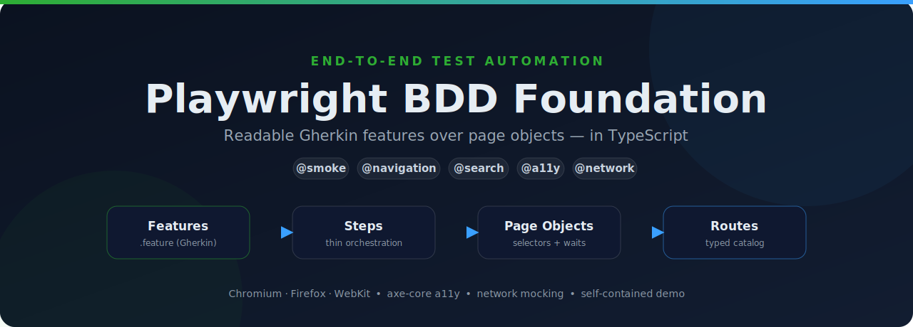

<p align="center">
  
</p>

# Playwright BDD Foundation

[](https://github.com/scherednychenko/playwright-bdd-foundation/actions/workflows/e2e.yml)
[](https://playwright.dev/)
[](https://www.typescriptlang.org/)
[](LICENSE)

A small, readable **BDD + Playwright** end-to-end testing starter. Gherkin
features sit on top of page objects, backed by a typed route catalog — so the
coverage reads like product behavior while the implementation details stay
localized and easy to change.

It ships with a bundled demo app, so the suite is **green the moment you clone
it** — no external environment, no internet, no flaky shared staging.

```bash
pnpm install
pnpm exec playwright install --with-deps chromium
pnpm run e2e:test     # boots the demo app and runs the suite
```

```
✓  Public navigation › Public page opens successfully @smoke @navigation @public
✓  Search › Searching returns matching results @smoke @search
✓  Search › Searching for an unknown term shows a no-results message @smoke @search
✓  Search resilience › Shows an error message when the search API is unavailable @smoke @search @network
✓  Accessibility › Public pages have no critical accessibility violations @smoke @a11y

  8 passed
```

## Why this exists

Most E2E suites rot because the "what" (product behavior) and the "how"
(selectors, waits) are tangled in the same file. This starter keeps them in
separate layers and demonstrates a pattern that scales from a handful of smoke
checks to a full regression suite without changing its shape.

It's deliberately small, but it exercises the full shape of a real suite. See
[`ARCHITECTURE.md`](ARCHITECTURE.md) for the design rationale, and
[`TEST-PLAN.md`](TEST-PLAN.md) for the test-design strategy and coverage matrix.

## What it demonstrates

- **BDD layer** with [`playwright-bdd`](https://github.com/vitalets/playwright-bdd):
  Gherkin features compile to Playwright specs.
- **Layered design** — features → steps → page objects → typed route catalog.
- **Page Object Model** with real interaction: a search flow with positive and
  negative cases ([`search.page.ts`](e2e/pages/search.page.ts)).
- **Network interception** (`page.route`) to simulate a failing backend and
  verify graceful degradation — deterministically, in isolation.
- **Accessibility testing** with [`axe-core`](https://github.com/dequelabs/axe-core-npm)
  gating critical/serious WCAG 2.1 A/AA violations.
- **Data-driven** `Scenario Outline` so adding a page is a one-line change.
- **Tag-based CI slicing** controlled by `E2E_TAGS`, never by editing features.
- **Self-contained** runs via a zero-dependency demo server wired through
  Playwright's `webServer`.
- **Cross-browser** (Chromium/Firefox/WebKit) — opt-in via `E2E_ALL_BROWSERS=1`,
  run on `main` in CI.
- **CI-ready**: GitHub Actions runs typecheck, lint, format, and the suite on
  every PR; uploads traces/reports as artifacts; Dependabot keeps deps current.
- **Code quality**: TypeScript strict, ESLint (flat config) + Prettier, ESM,
  with traces, screenshots, and video retained on failure for debugging.

## Setup

```bash
pnpm install
pnpm exec playwright install --with-deps chromium
cp .env.example .env   # optional — only needed to target a real app
```

By default the suite runs against the bundled demo app at `http://localhost:3000`.
To point it at a deployed application instead, set `BASE_URL` in `.env`:

```bash
BASE_URL=https://your-app.example.com
```

When `BASE_URL` is set, the demo server is skipped automatically.

## Commands

| Command                 | Description                                   |
| ----------------------- | --------------------------------------------- |
| `pnpm run e2e:test`     | Generate specs and run the suite              |
| `pnpm run e2e:ui`       | Run in Playwright's interactive UI mode       |
| `pnpm run e2e:list`     | List the generated tests without running them |
| `pnpm run e2e:generate` | Regenerate specs from feature files only      |
| `pnpm run typecheck`    | Type-check the suite with `tsc`               |
| `pnpm run lint`         | Lint with ESLint (flat config)                |
| `pnpm run format`       | Format with Prettier                          |
| `pnpm run format:check` | Check formatting without writing              |
| `pnpm run demo`         | Start the bundled demo app standalone         |

Run the full cross-browser matrix locally:

```bash
pnpm exec playwright install --with-deps    # firefox + webkit too
E2E_ALL_BROWSERS=1 pnpm run e2e:test
```

## Project structure

```text
demo/                 # bundled demo app (so the suite is self-contained)
  public/             #   static home / about / search pages
  server.mjs          #   zero-dependency static server + tiny JSON API
e2e/
  data/navigation.ts  # typed route catalog (single source of truth)
  features/           # Gherkin feature files (navigation, search, accessibility)
  fixtures/           # Playwright/BDD fixtures
  pages/              # page objects (selectors + waits live here)
  steps/              # step definitions (thin orchestration)
  playwright.config.ts
  tsconfig.json
.github/
  workflows/e2e.yml   # CI: static checks + chromium on PR, full matrix on main
  dependabot.yml      # weekly dependency + actions updates
eslint.config.mjs     # ESLint flat config
TEST-PLAN.md          # scope, test-design strategy, coverage matrix
ARCHITECTURE.md       # design rationale and how this scales up
```

## How it works

1. Feature files in `e2e/features` describe behavior in Gherkin.
2. `playwright-bdd` generates Playwright specs into `e2e/.features-gen`.
3. Step definitions in `e2e/steps` map each step to a page-object call.
4. The page object asserts URL, document readiness, and a stable page marker.
5. Route metadata (path, expected title, ready text) lives in one typed catalog.

## Add a page

Add an entry to [`e2e/data/navigation.ts`](e2e/data/navigation.ts):

```ts
{
  key: 'reports',
  path: '/reports',
  title: /reports/i,
  readyText: /reports/i,
}
```

Then add the key to the examples table in
[`e2e/features/navigation/public-navigation.feature`](e2e/features/navigation/public-navigation.feature):

```gherkin
Examples:
  | page    |
  | home    |
  | about   |
  | reports |
```

That's the whole change — no new step or spec code.

## Tags

| Tag           | Meaning                                              |
| ------------- | ---------------------------------------------------- |
| `@smoke`      | Fast checks for CI and pull requests                 |
| `@navigation` | Page-open coverage                                   |
| `@public`     | No login required                                    |
| `@search`     | Search feature                                       |
| `@network`    | Uses network interception / simulated backend states |
| `@a11y`       | Automated accessibility (axe-core, WCAG 2.1 A/AA)    |

Select a slice at run time with `E2E_TAGS`:

```bash
E2E_TAGS='@search and not @network' pnpm run e2e:test
```

See [`TEST-PLAN.md`](TEST-PLAN.md) for the full coverage matrix.

## License

[MIT](LICENSE) © Sergiy Cherednychenko
